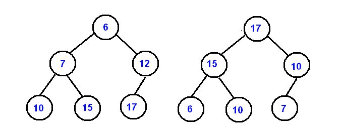
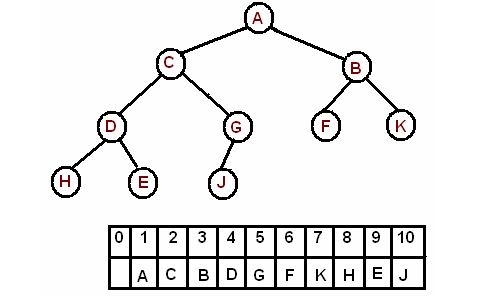

# Heap
- [Summary](#summary)
- [Basics](#basics)
  - [Definition and Property](#definition)
  - [Representation](#representation)
  - [Operations](#operations)
    - [Shift Up](#shiftup)
    - [Shift Down](#shiftDown)
    - [Push](#push)
    - [Remove](#remove)
      - [Pop](#pop)
      - [Remove others](#removeOthers)
    - [Replace](#replace)
    - [Search](#search)
    - [Build Heap](#buildHeap)
    - [Heap Sort](#heapSort)
- [Reference](https://www.cs.cmu.edu/~adamchik/15-121/lectures/Binary%20Heaps/heaps.html)


## <h2 id = "summary">Summary</h2>

## <h2 id = "basics">Basics</h2>
### <h3 id = "definition">Definition and properties</h3>
- A binary heap is a complete binary tree, which satisfies the corresponding heap property.
- Heap has two types:
  - Max heap: Each node should larger than or **equal to** its two children.
  - Min heap: Each node should smaller than or **equal to** its two children.
- In heap, the root always hold the element with the highest priority(the min or the max).
- Because the heap is a complete tree, so when there are N nodes, the height of the heap is log(N)

### <h3 id = "representation">Representation by array</h3>
The heap can be represented by storing its level order traversal in an array

#### Properties:
- Index 0 should be empety
- **Index 1** stores **the root** of the heap
- Left child stores in **Index 2 * k**
- Right child stores in **Index 2 * k + 1**
- Parent stores in **Index k/2**
### <h3 id = "operations">Operations</h3>
#### <h4 id = "shiftup">Shift up(percolating up)</h4>
- This operation is used to shift the value up to the right place
```java
public void shiftUp(int pos){
    int temp = data[pos];
    while(pos >= 1 && data[pos/2] < temp){
      data[pos/2] = data[pos];
      pos = pos/2;
    }
    data[pos] = value;
}
```
- Time Complexity: O(log(n))
#### <h4 id = "shiftdown">Shift down(percolating down)</h4>
- This operation is used to shift the value down to the right place
```java
private void shiftDown(int[] A, int pos){
    int leftIndex = (pos + 1) * 2 - 1;
    int rightIndex = leftIndex + 1;
    int temp = A[pos];

    while(leftIndex < size){
        int minIndex = leftIndex;
        if(rightIndex < size && A[leftIndex] > A[rightIndex]){
            minIndex = rightIndex;
        }

        if(A[minIndex] >= temp){
            break;
        } else {
            swap(A, pos, minIndex);
            pos = minIndex;
            leftIndex = (minIndex + 1) * 2 - 1;
            rightIndex = leftIndex + 1;
        }
    }
}
```
- Time Complexity: O(log(n))
#### <h4 id = "push">Push</h4>
1. The position and the size of the array should be checked. If the position is the end of the array then the array should be resized.
2. Inserting the new value at the end of the heap then **percolating up**
```java
public void push(int value){
  // this is for the min heap
  size++;
  if(size >= data.length){
    resize();
  }

  data[size] = value;
  shiftUp(pos);

}
```
- Time Complexity: O(log(n))
#### <h4 id= "remove">Remove</h4>
##### <h5 id = "pop">Pop</h5>
1. The max/min value is located at the index 1;
2. To remove it, swap the root with the last node
3. **percolating down** the root
``` java
public int pop(){
    // this is for the min heap
    //TODO resize part
    int temp = data[size];
    swap(data, size, 1);
    size--;

    shiftDown(1);
    return temp;
}

```
- Time Complexity: O(log(n))
##### <h5 id= "removeOthers">Remove other node</h5>
```java
public int remove(index){
   // this is for the min heap
   //TODO resize part
   int temp = data[index];

   swap(data, index, size);
   size--;
   if(data[index] < data[index/2]){
      shiftUp(index);
   } else {
      shiftDown(index);
   }
   return temp;

}
```
- Time Complexity: O(log(n))
#### <h4 id = "replace">Replace</h4>
#### <h4 id = "search">Search</h4>
- loop the array to find the value
- Time complexity is O(N)
#### <h4 id= "buildHeap">Build heap</h4>
```java
public void buildHeap(int[] A){
    for(int i = size/2; i>=0; i--){
        shiftDown(A, i);
    }
}
```
- Time Complexity : O(n)
- //TODO analysis
#### <h4 id = "heapSort">Heap Sort</h4>
- First make the array a max heap then
```java
public void heapSort(int[] A){
    buildHeap(A);
    for(int i = size - 1; i >= 0; i--){
        swap(A, i, 0);
        size--;
        shiftDown(A, 0);
    }
}
```
- Time Complexity: O(nlog(n))

## <h2 id = "application">Application</h2>
- Dynamically get the max/ min value no matter add or remove any values including the current max/ min value;
- Get the value with the max priority.
- Always return the k-th largest/ smallest priority element
  To get the k-th largest element, we maintain a min-heap with size k, everytime return heap.peek();
  ``` java
  public int kthLargest(int[] nums, int k){
      if(nums == null || nums.length == 0 || k < 0){
          return -1;
      }

      PriorityQueue<Integer> heap = new PriorityQueue<>();

      for(int i = 0; i < nums.length; i++){
          if(heap.size() < k){
              heap.offer(nums[i]);
          } else if(heap.peek() < nums[i]){
              heap.poll();
              heap.offer(nums[i]);
          }
      }
      return heap.peek();
  }

  ```
- arrange same element can not be adjacent
- Implement Djkistra algorithm using heap
- Implement Priority Queue. In Java, heap can be implemented by **PriorityQueue**

| #   | # of Prob | Status     | Note                                                                               |
| --- | --------- | ---------- | ---------------------------------------------------------------------------------- |
| 1   | 239       | To be Done |                                                                                    |
| 2   | 23        | Completed  | [Note.merge](https://github.com/rexbean/L/blob/master/Type/note.md#merge)          |
| 3   | 347       | Completed  | [Note.KFrequent](https://github.com/rexbean/L/blob/master/Type/note.md#kFrequency) |
| 4   | 703       | Completed  |                                                                                    |
| 5   | 451       | Completed  | Bucket sort + heap                                                                 |
| 6   | 692       | Completed  | Top k frequent                                                                                   |


# Priority Queue
