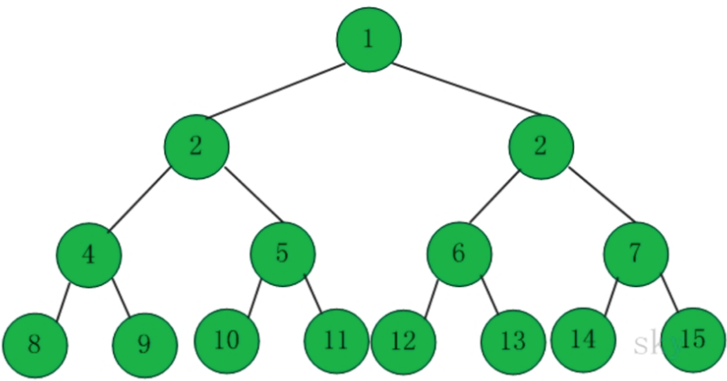
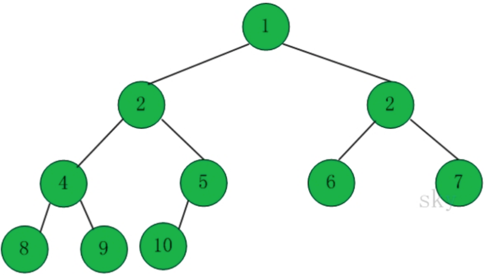

# Binary Search Tree
- [Concept](#concept)
  - [Binary Tree](#binaryTree)
  - [Binary Search Tree](#bst)

| #   | # of Prob | Status    | Note                                 |
| --- | --------- | --------- | ------------------------------------ |
| 1   | 897       | Completed | inorder of the BST is a sorted array |
|     |           |           |                                      |

<h3 id = "binaryTree">Binary Tree</h3>

  - **What is a Binary Tree**
  Binary tree is a tree that the number of any node's children is at most 2.

  - **Property**
    1. The number of node on level i is maximum: **2^(i - 1)(i >= 1)**
    2. The binary tree whose height is k has at most **2^k - 1 nodes.**
    3. N nodes can build a binary tree whose height is at least **lgn+1**
    4. n0 represents the number of nodes which has no children.
    <br>n2 represents the number of nodes which has 2 children.
    <br>**no = n2 + 1**;
  - **Full Binary Tree**
    - A tree whose whose all nodes have 2 children.
    - If it's height is h, and the number of nodes are **2^h - 1**;


    - [Judge a full binary tree](#judgeFullBT)

  - **Complete Binary Tree**
    - A tree whose each level must be all filled, except the last level. The nodes are as far left as possible.
    

    - Full binary tree is a special complete binary tree.
    - [Judge a complete binary Tree](#judgeCompleteBT)
<h2 id = "bst">Binary Search Tree</h2>

  - **<h3 id ="definition">What is a Binary Search Tree</h3>**
    Binary search tree is a special binary tree. Any node's value should larger or equal to it's left child's val. It also should smaller or equal to it's right child's val.

  - **<h3 id = "node">Node</h3>**

    ``` Java
    class Node{
        int val;
        public Node left;
        public Node right;
        public Node parent;
        public Node(int val){
            this.val = val;
        }
    }
    ```
  - **<h3 id = "successor">Successor</h3>**
  Successor is the node which has the smallest value among all nodes whose value are larger than the root's.
    ``` Java
    private Node successor(Node root){
        if(root == null){
            return null;
        }
        if(root.right != null){
            Node cur = root.right;
            while(cur.left != null){
                cur = cur.left;
            }
            return cur;
        }

        Node cur = root;
        Node parent = cur.parent;
        while(parent != null && parent.right == cur){
            cur = parent;
            parent = cur.parent;
        }
        return parent;
    }
    ```
  - <h3 id = "predecessor">Predecessor</h3>Predecessor is the node which has the largest value among all nodes whose value is smaller than the root's.

    ``` Java
    private Node predecessor(Node root){
        if(root == null){
            return null;
        }
        if(root.left != null){
            Node cur = root.left;
            while(cur.right != null){
                cur = cur.right;
            }
            return cur;
        }
        Node cur = root;
        Node parent = root.parent;
        while(parent != null && parent.left == cur){
            cur = parent;
            parent = cur.parent;
        }
        return parent;
    }
    ```
  - **<h3 id = "addNode">Add a node</h3>**
    ```Java
    private void add(Node root, Node new){
        if(node == null){
            return;
        }
        Node cur = root;
        Node parent = null;
        while(root != null){
            parent = cur;
            if(cur.val > new.val){
                cur = cur.left;
            } else {
                cur = cur.right;
            }
        }
        new.parent = parent;
        if(parent == null){
            new = root;
        } else if(parent.val < new.val){
            parent.right = new;
        } else {
            parent.left = new;
        }
    }
    ```
  - **<h3 id = "deleteNode">Delete a node<h3>**
  - Conditions
  
  | Condition          | Operation                 |
  | ------------------ | ------------------------- |
  | Have no children   | parent.child = null       |
  | Have one children  | parent.child = node.child |
  | Have two childrent | node.val = sucessor.val<br> successor' parent.child = sucessor.child                          |
  - Implementation
    ``` Java
    private void delete(Node root, Node n){
        if(root == null || n == null){
            return;
        }
        boolean isLeft = false;
        if(n.parent.left == n){
            isLeft = true;
        }
        if(n.left == null && n.right == null){
            if(isLeft){
                n.parent.left = null;
            } else {
                n.parent.right = null;
            }
        }
        return;
        if(n.left == null || n.right == null){
            Node child = n.left == null? n.right: n.right;
            if(isLeft){
                n.parent.left = child;
            } else {
                n.parent.right = child;
            }
            return;
        }
        return;
        Node successor = sucessor(n);
        n.val = succesor.val;
        delete(successor);

    }

    ```

  - Traversal
    - Inorder
      - Recursion
      - Stack
    - PreOrder
      - Recursion
      - Stack
    - PostOrder
      - Recursion
      - Stack
    - Bread-First Search(level traversal)
    - Morris Traversal
