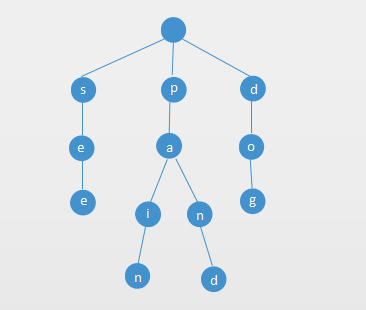

# Trie
- Summary
- Definition
  - Node
- Operations
  - Insert
  - Search
  - Delete
- Reference:

## Summary

## Definition
Trie is a tree-like data structure, each node will store a letter of an alphabet. By structuring like a tree, we can retrieve a string/ word/ value by traversing down a branch path of the tree. Like the trie below. **see, pain, pand, dog** has been inserted into the tire.



### Node
For each node, we can get value of the node/ check whether it is a word or not or find the all way down.

So the we should define a Node class like below:
``` java
private class Node {
  boolean hasValue;
  T value;
  HashMap<Character, Node> next;
  public Node() {
    hasValue = false;
    next = new HashMap<>();
  }
}
```
Every trie has a empty Node as the root.

## Operations
### Insert
From the root, each character in the key will be sequentially picked out and inserted into the trie until the last character. Then the value will be inserted into the leaf.
``` java
public boolean insert(String key, T value) {
    return insertHelper(root, key, 0, value);
}

private boolean insertHelper(Node root, String key, int index, T value) {
    // if this is the last character in the node
    if(index == key.length()) {
        if(root.hasValue) {
            return false;
        }
        root.hasValue = true;
        root.value = value;
        return true;
    }
    Character c = key.charAt(index);
    // if the node does not contains character
    if(!root.next.containsKey(c)) {
        root.next.put(c, new Node(null));
    }
    return insertHelper(root.next.get(c), key, index + 1, value);
}
```
### Search
From the root, each character in the key will be sequentially picked out to get the next node. If there is no node, return null, otherwise return value.
``` java
public T search(String key) {
    return searchHelper(root, key, 0);
}

private T searchHelper(Node root, String key, int index) {
    if(index == key.length()){
        return root.value;
    }

    Character c = key.charAt(index);
    if(!root.next.containsKey(c)) {
        return null;
    }
    return searchHelper(root.next.get(c), key, index + 1);
}
```
### Delete
Find the key first, if the key does not exists then return. If the key exists, then find the position first. Remove the value from the node, if the node does not have any children then return null;
``` java
public void delete(String key) {
    if(search(key) != null) {
        root = deleteHelper(root, key, 0);
    }
}

private Node deleteHelper(Node root, String key, int index) {
    // base case
    if(index == key.length()) {
        root.hasValue = false;
        root.value = null;
        if(root.next.size() == 0) {
            return null;
        }
        return root;
    }

    Character c = key.charAt(index);
    Node n = deleteHelper(root.next.get(c), key, index + 1);
    if(n == null) {
        root.next.remove(c);
        if(root.next.size() == 0 && !root.hasValue) {
            return null;
        }
    }
    return root;
}
```
